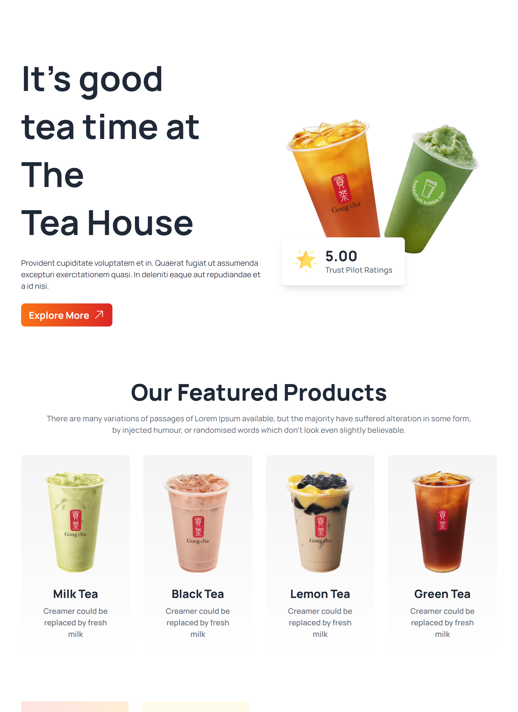

# Tea House Website

Tea House is a responsive website developed using HTML and CSS. It features a clean and engaging design to showcase various tea products. The website uses Daisy UI components, which are part of the Tailwind CSS framework.

## Table of Contents
- [Features](#features)
- [Getting Started](#getting-started)
- [Usage](#usage)
- [Sections](#sections)
  - [Header](#header)
  - [Featured Products](#featured-products)
  - [Great Tea, Freshly Presented](#great-tea-freshly-presented)
  - [Super Clients](#super-clients)
  - [News & Events](#news--events)
  - [Footer](#footer)
- [Contributing](#contributing)

## Features
- Responsive design for seamless user experience on various devices.
- Engaging hero section with a call-to-action button.
- Featured product section showcasing various tea products.
- Great Tea, Freshly Presented section highlighting the unique aspects of the tea.
- Super Clients section showcasing client testimonials.
- News & Events section for keeping users informed.
- Footer with navigation links, newsletter subscription, and copyright information.

## Getting Started
1. Clone the repository: `git clone https://github.com/ferdousahammed/tea-house-webdev-daisyui.git`
2. Open `index.html` in your web browser to view the website.

## Usage
- Explore different sections of the website, including featured products, client testimonials, and news.
- Click on the "Explore More" button to navigate to different parts of the website.
- Check out the news and events section for the latest updates.

## Sections

### Header
The header section includes a captivating hero banner with a headline, description, and a call-to-action button to explore more.

### Featured Products
The featured products section showcases different types of tea with images, descriptions, and unique features.

### Great Tea, Freshly Presented
This section highlights the quality and uniqueness of the tea products, presented in an appealing manner.

### Super Clients
Discover what our super clients have to say. Testimonials are provided with images, names, and roles.

### News & Events
Stay updated with the latest news and events related to Tea House. Each entry includes a date, title, and description.

### Footer
The footer section contains essential links, a newsletter subscription form, and copyright information.

## Contributing
Contributions are welcome! Follow these steps:
1. Fork the project.
2. Create your feature branch: `git checkout -b feature/new-feature`
3. Commit your changes: `git commit -m 'Add a new feature'`
4. Push to the branch: `git push origin feature/new-feature`
5. Submit a pull request.
